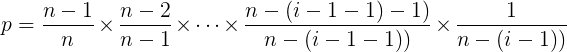

# Shuffle

## Fisher-Yates
```
1. Write down the numbers from 1 through N.
2. Pick a random number k between one and the number of unstruck numbers remaining (inclusive).
3. Counting from the low end, strike out the kth number not yet struck out, and write it down at the end of a separate list.
4. Repeat from step 2 until all the numbers have been struck out.
5. The sequence of numbers written down in step 3 is now a random permutation of the original numbers.
```

### Proof
```
Prob of element M placed at position i
= Prob of element M not selected when selecting for the first (i-1) positions
  * Prob of element M selected when selecting for position i
```



## The modern algorithm
```
-- To shuffle an array a of n elements (indices 0..n-1):
for i from n−1 downto 1 do
     j ← random integer such that 0 ≤ j ≤ i
     exchange a[j] and a[i]
```
or
```
-- To shuffle an array a of n elements (indices 0..n-1):
for i from 0 to n−2 do
     j ← random integer such that i ≤ j < n
     exchange a[i] and a[j]
```

Amazing intuitive explanation
 * http://eli.thegreenplace.net/2010/05/28/the-intuition-behind-fisher-yates-shuffling/#id5
